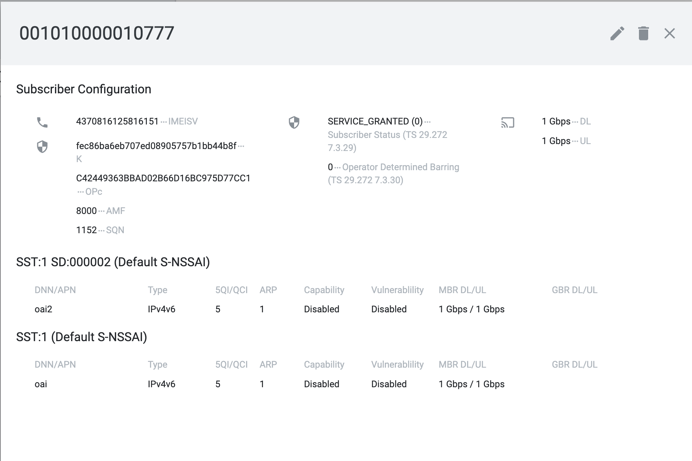

# docker_open5gs for ORANSlice

Two types of docker configurations for Open5GS are provided.

- CN with single AMF/SMF/UPF to handle two slices/S-NSSAIs Configuration
- CN with single AMF and two SMFs/UPFs to handle  handle two slices/S-NSSAIs Configuration

The first config supports multiple slices configured at gNB/UEs but it enables CN slicing with single SMF and UPF for all network slices.
The second config  provides dedicated core network functions (SMF/UPF) per network slice.

A UERANSIM docker image is provided to test if the network slicing in open5gs CN works.

## Open5GS with Single AMF/SMF/UPF with Two S-NSSAIs Configuration

### Image Building
The dockerfile is `base/Dockerfile`. To build the docker images for open5gs CN, run
```
cd docker_open5gs/base
docker build -f Dockerfile --no-cache --force-rm -t docker_open5gs .
```

### CN Deployment
The deployment config file of single AMF/SMF/UPF open5gs CN is `5g-sa-deploy.yaml`. To deploy the open5gs CN, run
```
docker compose -f 5g-sa-deploy.yaml up -d
```


## Open5GS with Single AMF and Two SMFs/UPFs based on S-NSSAI Configuration

### Image Building
The dockerfile is `base/Dockerfile_Slicing`. To build the docker images for open5gs CN, run
```
cd docker_open5gs/base
docker build -f Dockerfile_Slicing --no-cache --force-rm -t docker_open5gs_slicing .
```

### CN Deployment
The deployment config file is `5g-sa-deploy-slicing.yaml`. To deploy the open5gs CN, run
```
docker compose -f 5g-sa-deploy-slicing.yaml up -d
```

## UERANSIM for Open5GS Debug

### Image Building
The dockerfile is `ueransim/Dockerfile`. To build the docker images for UERANSIM, run
```
cd docker_open5gs/ueransim
docker build -f Dockerfile --no-cache --force-rm -t docker_ueransim .
```

## UE SIM/Subscriber Profile 

We need add UE SIM info to the open5gs database to make UE able to get connected.

Open (http://<DOCKER_HOST_IP>:9999) in a web browser, login with following credentials
```
Username : admin
Password : 1423
```
Using Web UI, add a subscriber/SIM info. The results should like:



### gNB and UE 

To deploy UERANSIM gNB and attach to check the logs
```
docker compose -f nr-gnb.yaml up -d && docker container attach nr_gnb

```

To deploy UERANSIM ue and attach to check the logs
```
docker compose -f nr-ue.yaml up -d && docker container attach nr_ue
```


## ORANSlice gNB Config for Open5GS

Use `oai/oai_slicing_usrpX310_open5gs.conf` for ORANSlice OAI gNB config (rfsim or USRP X310).